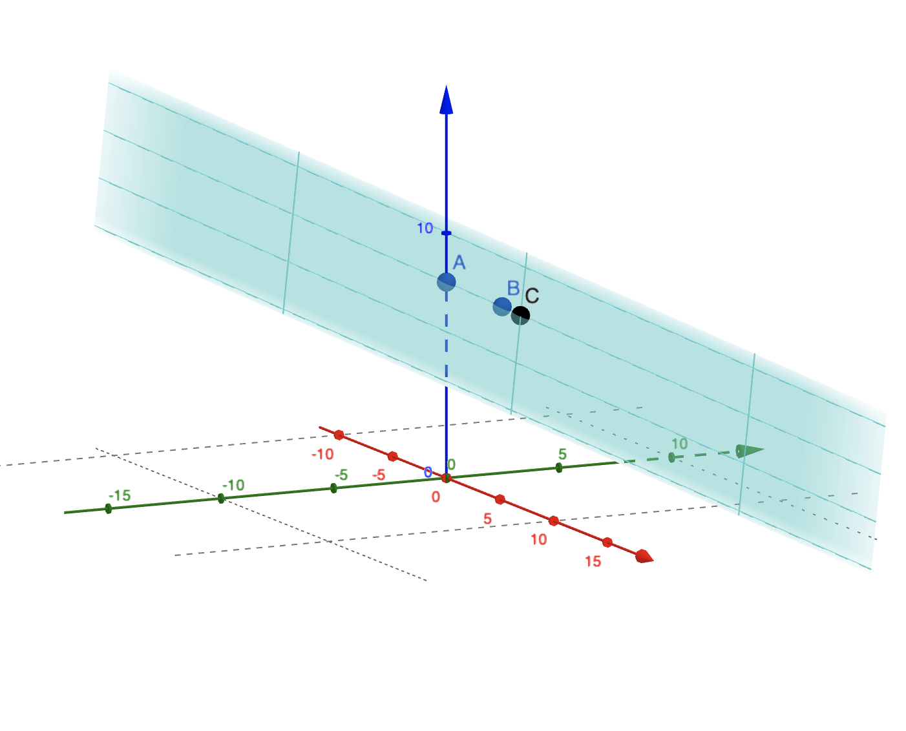

# diophantine-methods
Solve Diophantine Equations and Diophantine Approximations. Zero dependencies and heavily optimized.

## Installation
```bash
npm install diophantine-methods
```
## Diophantine Equations
Turn an equation written symbolically into a DiophantineEquation object. The variables of the object are parameterized and manipulated in terms of free variables t_1, t_2, ... t_{n-1}.
```javascript
import { returnDiophantineEquation } from 'diophantine-methods'

// Example: The set of nickels, dimes, and quarter combinations that equal two dollars.
const equation = returnDiophantineEquation("5n + 10d + 25q = 200");

equation.getVariables();    // [n, d, q]
equation.getCoefficients(); // [5, 10, 25]
equation.getSolution();     // 200

// Returns a ParametricEquation object.
equation.n;

// View the parameteric space and evaluate it for integer values of t₁, t₂.
equation.n.toString();      // 40 + 5t₁ + 10t₂
equation.d.toString();      // -5t₂
equation.q.toString();      // -1t₁

const solutions = [];
equation.getVariables().forEach((v, index) => {
    solutions.push(equation[v].evalWithParameters([0, -1]));
});
console.log(solutions);     // [30, 5, 0] or 30 nickels, 5 dimes, 0 quarters.

// Generate solutions directly.
equation.randomSolution();          // [715, -205, -53]
equation.leastPositiveSolution();   // [0, 0, 8] 
equation.leastPositiveMagnitude();  // [1, 2, 7]
```
### Geometric Interpretation
The ParametricEquation objects return n-dimensional planes that only intersect at integer coordinates.

The vector with the least positive magnitude (point B) is the vector nearest the intersection of the plane and its normal vector (point C) with integer coordinates in its terminal point.

The vector with the least positive solution is the nearest projection onto one of the ParametricEquation planes (point A).



(Image from [Geogebra](https://www.geogebra.org/3d?lang=en).)

## Diophantine Approximations

Find rational numbers p/q that are within epsilon distance of a real number.
```javascript
import * as methods from 'diophantine-methods';

const realNum = Math.E;
const epsilon = 0.0000001;

// Returns approximations p/q as [p, q].
methods.continuedApproximation(realNum, epsilon);   // [23225, 8544]
methods.fareyApproximation(realNum, epsilon);       // [15062, 5541]
methods.dirichletApproximation(realNum, epsilon);   // [25946, 9545]
```
For details on the approximation algorithms and time complexity see [main.tex](./main.tex).

Won Outstanding Poster Presentation @ CUNY DRP 2023
